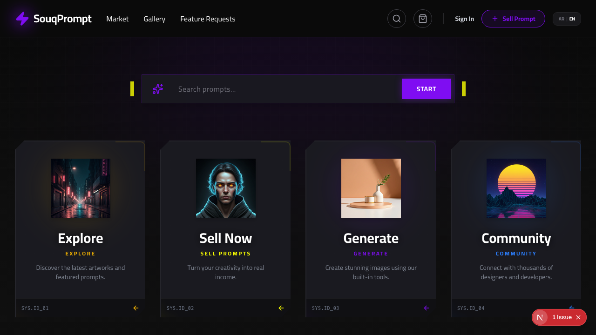
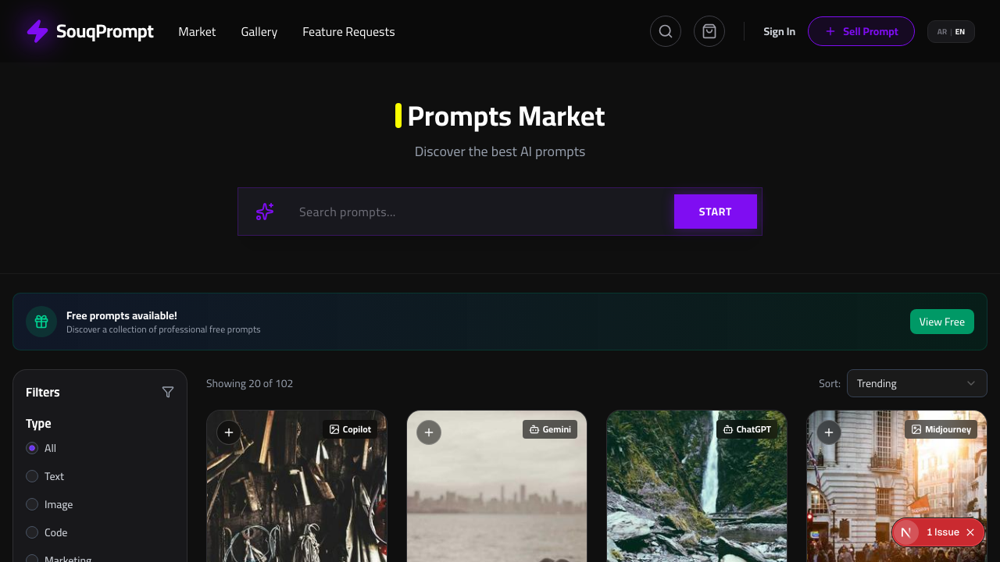
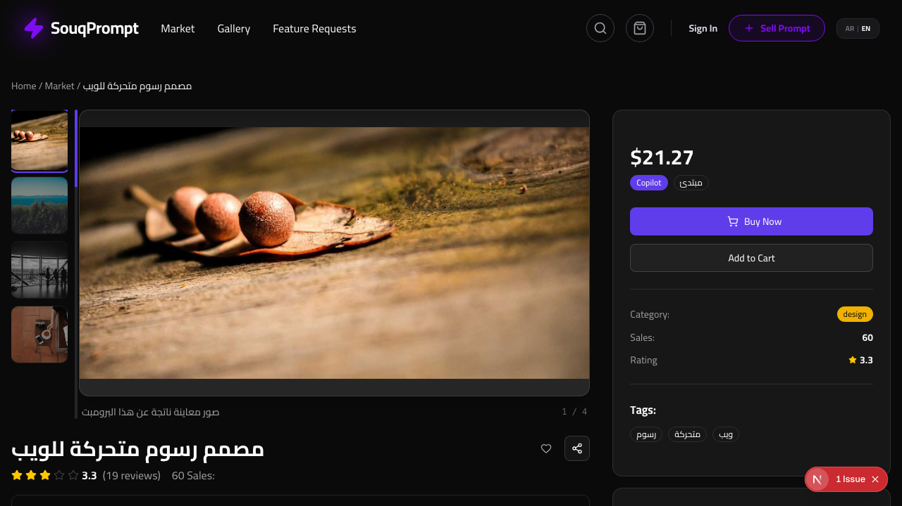
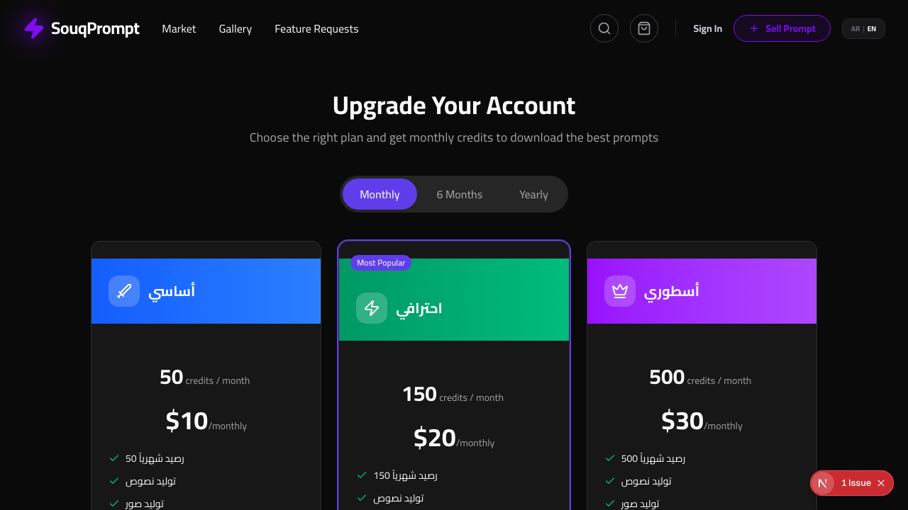
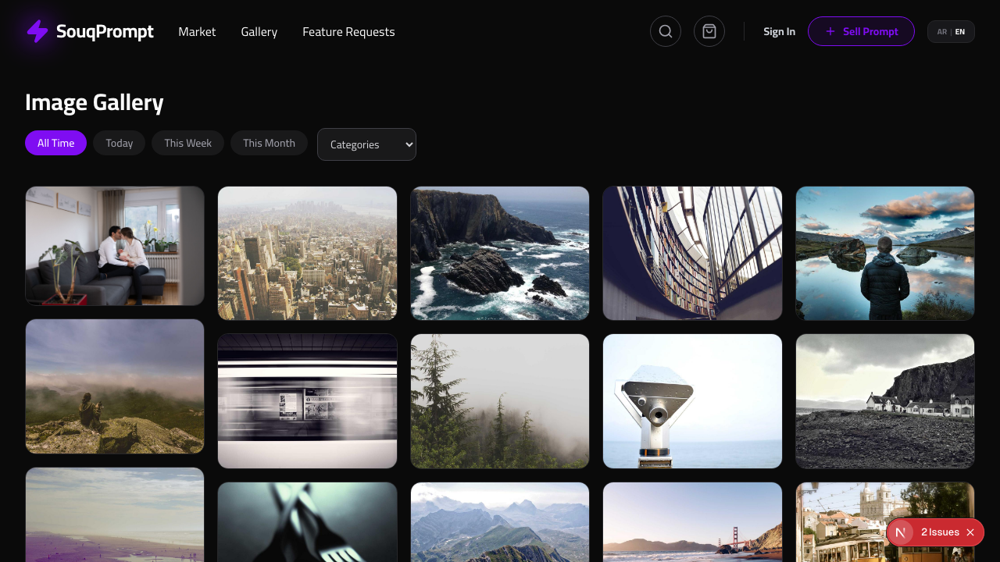

# PromptSouq

**A multivendor marketplace for AI prompts with Arabic RTL support — built with Next.js 16, Supabase, and Tailwind CSS 4.**

[](https://nextjs.org/)
[](https://www.typescriptlang.org/)
[](https://supabase.com/)
[](https://tailwindcss.com/)
[](LICENSE)

---

## Table of Contents

- [Screenshots](#screenshots)
- [Features](#features)
- [Tech Stack](#tech-stack)
- [Getting Started](#getting-started)
- [Project Architecture](#project-architecture)
- [Features Built](#features-built)
- [Scripts](#scripts)
- [Contributing](#contributing)
- [License](#license)

---

## Screenshots

### Homepage

RTL hero section with featured prompts and category highlights.



### Marketplace

Browse and filter AI prompts by category, price, and difficulty.



### Prompt Detail

Individual prompt page with seller info, reviews, and purchase options.



### Subscription Plans

Flexible subscription tiers with credit-based pricing.



### Community Gallery

User-contributed content and community-driven feature requests.



---

## Features

- **Arabic-first RTL interface** with full i18n support (Arabic + English)
- **AI prompt marketplace** — browse, search, buy, and sell prompts
- **Supabase Auth** — email/password, Google OAuth, Facebook OAuth with PKCE flow
- **Stripe payments** — hosted checkout, subscriptions, and seller payouts via Stripe Connect
- **Seller storefronts** with public profiles and leaderboard/ranking system
- **User dashboard** with purchase history, profile management, and settings
- **Credit system** and tiered subscription plans
- **Community gallery** and feature request board
- **Smart search** with recent and trending suggestions
- **Admin panel** for content and user management
- **Dark/light theme** support with system preference detection
- **Mobile-first responsive design** across all pages

---

## Tech Stack

| Layer | Technology | Version |
|-------|-----------|---------|
| Framework | Next.js (App Router) | 16.x |
| UI Library | React | 19.x |
| Language | TypeScript (strict) | 5.x |
| Styling | Tailwind CSS | 4.x |
| Components | shadcn/ui (New York) | latest |
| Auth | Supabase Auth (@supabase/ssr) | latest |
| Database | Supabase (Postgres) | 17.x |
| ORM | Drizzle ORM + drizzle-kit | latest |
| Payments | Stripe | latest |
| Validation | Zod | 4.x |
| Forms | React Hook Form | 7.x |
| State | Zustand | 5.x |
| i18n | i18next + react-i18next | 25.x |
| E2E Testing | Playwright | latest |
| Icons | Lucide React | latest |

---

## Getting Started

### Prerequisites

- **Node.js** 18 or later
- **npm** (do not use yarn, pnpm, or bun)
- A **Supabase** account and project
- A **Stripe** account (optional, for payments)

### Installation

1. **Clone the repository**

   ```bash
   git clone https://github.com/amr-khalil/promptsouq.git
   cd promptsouq
   ```

2. **Install dependencies**

   ```bash
   npm install
   ```

3. **Configure environment variables**

   Create a `.env.local` file in the project root:

   ```env
   NEXT_PUBLIC_SUPABASE_URL=your-supabase-url
   NEXT_PUBLIC_SUPABASE_PUBLISHABLE_KEY=your-anon-key
   SUPABASE_SERVICE_ROLE_KEY=your-service-role-key
   DATABASE_URL=your-postgres-connection-string

   # Optional — required only if Stripe payments are enabled
   STRIPE_SECRET_KEY=your-stripe-secret
   NEXT_PUBLIC_STRIPE_PUBLISHABLE_KEY=your-stripe-pub-key
   STRIPE_WEBHOOK_SECRET=your-webhook-secret
   ```

4. **Run database migrations**

   ```bash
   npx drizzle-kit migrate
   ```

5. **Seed the database** (optional)

   ```bash
   source .env.local && npx tsx src/db/seed.ts
   ```

6. **Start the development server**

   ```bash
   npm run dev
   ```

   Open [http://localhost:3000](http://localhost:3000) in your browser.

---

## Project Architecture

```
src/
├── app/                    # Next.js App Router
│   ├── [locale]/           # Locale-based routing (ar, en)
│   │   ├── (auth)/         # Auth pages (sign-in, sign-up, forgot-password)
│   │   ├── (main)/         # Public pages (market, prompt, seller, etc.)
│   │   └── (dashboard)/    # User dashboard
│   ├── api/                # API Route Handlers
│   └── auth/               # Auth callbacks
├── components/             # React components
│   └── ui/                 # shadcn/ui components
├── db/                     # Database layer
│   ├── schema/             # Drizzle table schemas
│   └── index.ts            # DB client
├── hooks/                  # Custom React hooks
├── lib/                    # Utilities
│   ├── supabase/           # Supabase clients (browser, server, admin)
│   └── schemas/            # Zod validation schemas
├── data/                   # Mock data (legacy)
└── i18n/                   # Internationalization
```

### Key Patterns

- **Server Components by default** — `"use client"` is applied only at the narrowest boundary needed.
- **No server actions** — all client-to-server mutations go through API Route Handlers in `src/app/api/`.
- **Drizzle ORM** for type-safe database access with schema files in `src/db/schema/`.
- **RTL-first layout** — the root HTML element uses `dir="rtl"` and `lang="ar"`.
- **Supabase Auth** with cookie-based sessions, PKCE OAuth flow, and admin role via `app_metadata`.

---

## Features Built

| # | Feature | Branch | Description |
|---|---------|--------|-------------|
| 001 | API Mock Data | `001-api-mock-data` | Initial API layer with mock data |
| 002 | Supabase DB Migration | `002-supabase-db-migration` | Migrate to Supabase Postgres with Drizzle ORM |
| 003 | Cart & Stripe Checkout | `003-cart-stripe-checkout` | Shopping cart with Zustand, Stripe hosted checkout |
| 004 | User Dashboard | `004-user-dashboard-purchases` | Purchase history and user profile |
| 006 | Sell Prompts | `006-sell-prompt` | Seller flow with Stripe Connect |
| 007 | Market Search & Seed | `007-market-search-seed` | Marketplace browsing and database seeding |
| 008 | Seller Leaderboard | `008-seller-leaderboard-storefront` | Public seller profiles and ranking |
| 009 | Free Prompts | `009-free-prompts` | Free prompt access and downloads |
| 010 | Subscriptions & Credits | `010-subscription-credits` | Stripe subscriptions and credit system |
| 011 | i18n Localization | `011-i18n-localization` | Arabic/English with i18next |
| 012 | Smart Search | `012-smart-search-bar` | Recent/trending search suggestions |
| 013 | Sell Form Enhancement | `013-sell-form-enhancement` | Image uploads, draft persistence |
| 014 | Seller & Admin Dashboards | `014-seller-admin-dashboards` | Analytics, earnings, admin panel |
| 015 | Community Gallery | `015-community-gallery-feedback` | User gallery and feature requests |
| 016 | Supabase Auth Migration | `016-supabase-auth-migration` | Migrate from Clerk to Supabase Auth |

---

## Scripts

```bash
npm run dev          # Start development server
npm run build        # Production build
npm run lint         # Run ESLint
npm run screenshots  # Capture page screenshots with Playwright
```

### Database Commands

```bash
npx drizzle-kit generate   # Generate migrations from schema changes
npx drizzle-kit migrate    # Apply pending migrations
npx drizzle-kit studio     # Visual DB browser (optional)
```

---

## Contributing

Contributions are welcome. To get started:

1. Fork the repository.
2. Create a feature branch from `main` (`git checkout -b feature/your-feature`).
3. Make your changes and ensure `npm run lint && npm run build` passes.
4. Commit with a clear, descriptive message.
5. Open a pull request against `main`.

Please follow the existing code patterns and conventions described in this README and in `CLAUDE.md`.

---

## License

This project is licensed under the [MIT License](LICENSE).
